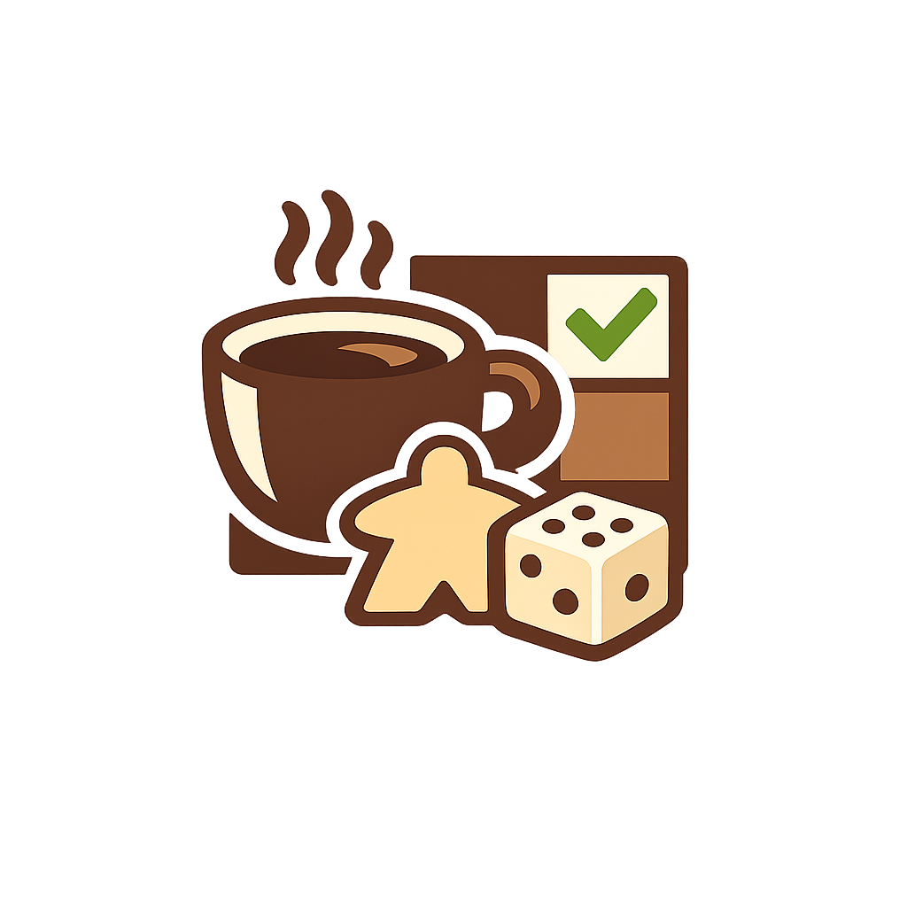

<div align="center">
  
  <h1>BoardGameOS</h1>
  <p><strong>Nền tảng quản lý vận hành dành cho quán board game cafe</strong></p>
  <p>
    Quản lý kho game, linh kiện, bàn chơi, giao nhận, nhân viên và báo cáo<br />
    trong một giao diện thống nhất, tích hợp trợ lý vận hành Gemini.
  </p>

  <p>
    
    
    
    
    
  </p>
</div>

---

BoardGameOS là website demo MVP phục vụ Đồ án môn Khởi nghiệp. Hệ thống mô phỏng quy trình vận hành của một quán board game cafe và hỗ trợ hỏi đáp dữ liệu bằng chatbot AI.

Dữ liệu nghiệp vụ được lưu trên trình duyệt bằng `localStorage`. Project chưa sử dụng database hoặc hệ thống xác thực backend thật; TanStack Start server function được dùng để bảo vệ Gemini API key.

<a id="muc-luc"></a>

## 📑 Mục lục

- [✨ Tính năng chính](#tinh-nang-chinh)
- [🧰 Công nghệ sử dụng](#cong-nghe-su-dung)
- [🛠️ Yêu cầu môi trường](#yeu-cau-moi-truong)
- [📦 Cài đặt project](#cai-dat-project)
- [🤖 Cấu hình Gemini](#cau-hinh-gemini)
- [▶️ Chạy thử ở local](#chay-thu-local)
- [👥 Tài khoản demo](#tai-khoan-demo)
- [🔐 Phân quyền giao diện](#phan-quyen-giao-dien)
- [📖 Hướng dẫn sử dụng](#huong-dan-su-dung)
- [💾 Dữ liệu và localStorage](#du-lieu-localstorage)
- [🧠 Kiến trúc chatbot AI](#kien-truc-chatbot)
- [✅ Build và kiểm tra](#build-kiem-tra)
- [🚀 Deploy lên Vercel](#deploy-vercel)
- [📁 Cấu trúc thư mục](#cau-truc-thu-muc)
- [🧭 Các route chính](#cac-route-chinh)
- [🔧 Xử lý lỗi thường gặp](#xu-ly-loi)
- [⚠️ Giới hạn của MVP](#gioi-han-mvp)
- [🧑‍💻 Ghi chú phát triển](#ghi-chu-phat-trien)

<a id="tinh-nang-chinh"></a>

## ✨ Tính năng chính

- Dashboard tổng quan game, bàn chơi, sự cố và hoạt động gần đây.
- Kho game: tìm kiếm, lọc, thêm game, xem chi tiết, cập nhật trạng thái và QR mô phỏng.
- Quản lý checklist linh kiện, lịch sử giao nhận, sự cố và ghi chú của từng game.
- Quản lý bàn: trạng thái, số khách, game đang chơi, nhân viên phụ trách và thời gian phiên.
- Quy trình giao game, nhận lại game và chuyển game sang bảo trì.
- Bộ lọc tư vấn game theo số người, thời lượng, thể loại, độ tuổi, độ khó, kiểu chơi và mức tương tác.
- Tìm kiếm toàn hệ thống theo game, bàn và nhân viên; hỗ trợ tìm tiếng Việt không dấu.
- Chatbot Gemini hỏi đáp về toàn bộ snapshot dữ liệu BoardGameOS và gợi ý game đang sẵn sàng.
- Quản lý nhân viên, vai trò, quyền hiển thị và khóa/mở khóa tài khoản.
- Trung tâm thông báo với trạng thái đã đọc và đã xử lý.
- Báo cáo hoạt động theo 7, 14 hoặc 30 ngày bằng Recharts.
- Cài đặt thông tin quán, tùy chọn thông báo và khôi phục dữ liệu mẫu.
- Giao diện responsive cho desktop, tablet và mobile.

<a id="cong-nghe-su-dung"></a>

## 🧰 Công nghệ sử dụng

| Công nghệ | Phiên bản | Mục đích |
| --- | --- | --- |
|  | 19 | Xây dựng giao diện component |
|  | 5.8 | Kiểm tra kiểu dữ liệu và giảm lỗi khi phát triển |
|  | 1.168 | Framework ứng dụng và server function cho Gemini |
|  | 1.170 | File-based routing và điều hướng không tải lại trang |
|  | 5.101 | Hạ tầng dữ liệu bất đồng bộ, sẵn sàng cho API về sau |
|  | 8 | Development server và build production |
|  | 4 | Theme và thiết kế responsive |
|  | 1.x | Hành vi và accessibility cho UI component |
|  | Source-based | Các component giao diện dùng chung |
|  | GenAI SDK 2.15 | Chatbot hỏi đáp dữ liệu vận hành |
|  | 3.24 | Kiểm tra JSON do Gemini trả về |
|  | 2.15 | Biểu đồ báo cáo 7, 14 và 30 ngày |
|  | 0.575 | Icon trong giao diện |
|  | 2.0 | Toast phản hồi sau thao tác |
|  | Browser API | Lưu dữ liệu và session demo trên trình duyệt |

<a id="yeu-cau-moi-truong"></a>

## 🛠️ Yêu cầu môi trường

- Git.
- Node.js `20.19.0` trở lên hoặc `22.12.0` trở lên; khuyến nghị dùng Node.js 22 LTS.
- npm 10 trở lên.
- Gemini API key nếu cần chạy chatbot AI. Các chức năng còn lại vẫn dùng được khi chưa cấu hình key.

Kiểm tra phiên bản đã cài:

```bash
node --version
npm --version
git --version
```

<a id="cai-dat-project"></a>

## 📦 Cài đặt project

### 1. Tải source code

```bash
git clone <repository-url>
cd BoardGameOS
```

Nếu đã có source code trên máy, chỉ cần mở terminal tại thư mục chứa `package.json`.

### 2. Cài dependency

```bash
npm install
```

Project có cả `package-lock.json` và `bun.lock`, nhưng tài liệu này sử dụng npm để thống nhất cách chạy.

<a id="cau-hinh-gemini"></a>

## 🤖 Cấu hình Gemini

Chatbot gọi Gemini thông qua TanStack Start server function. API key chỉ được đọc ở phía server và không được đưa trực tiếp vào source frontend.

### 1. Tạo file môi trường local

PowerShell:

```powershell
Copy-Item .env.example .env.local
```

Command Prompt hoặc Git Bash:

```bash
cp .env.example .env.local
```

Nếu lệnh sao chép không phù hợp với hệ điều hành, có thể tự tạo file `.env.local` tại thư mục gốc project.

### 2. Khai báo biến môi trường

```env
GEMINI_API_KEY=your-gemini-api-key
GEMINI_MODEL=gemini-3.6-flash
```

- `GEMINI_API_KEY`: API key lấy từ Google AI Studio.
- `GEMINI_MODEL`: model Gemini muốn sử dụng. Nếu bỏ trống, code mặc định dùng `gemini-3.6-flash`.
- Nếu model trên không khả dụng với tài khoản Google hiện tại, thay bằng model được Google AI Studio cung cấp cho API key đó.

<a id="chay-thu-local"></a>

## ▶️ Chạy thử ở local

Khởi động development server:

```bash
npm run dev
```

Mở URL được in trong terminal:

```text
http://localhost:8080/
```

<a id="tai-khoan-demo"></a>

## 👥 Tài khoản demo

| Vai trò | Email | Mật khẩu demo |
| --- | --- | --- |
| Chủ quán | `owner@boardgameos.vn` | `demo1234` |
| Nhân viên | `staff@boardgameos.vn` | `demo1234` |

Đăng nhập hiện là mô phỏng phục vụ MVP. Tài khoản chưa được xác thực bằng backend thật.

<a id="phan-quyen-giao-dien"></a>

## 🔐 Phân quyền giao diện

### Chủ quán

Chủ quán truy cập được toàn bộ chức năng:

- Tổng quan.
- Kho game.
- Bàn chơi.
- Giao nhận game.
- Kiểm tra linh kiện.
- Tư vấn game.
- Nhân viên.
- Báo cáo.
- Thông báo.
- Cài đặt.
- Chatbot AI.

### Nhân viên

Nhân viên sử dụng các chức năng vận hành:

- Tổng quan.
- Kho game.
- Bàn chơi.
- Giao nhận game.
- Kiểm tra linh kiện.
- Tư vấn game.
- Chatbot AI.

<a id="huong-dan-su-dung"></a>

## 📖 Hướng dẫn sử dụng

### 1. Đăng nhập và xem tổng quan

1. Mở `/login`.
2. Chọn tài khoản Chủ quán hoặc Nhân viên.
3. Bấm **Đăng nhập**.
4. Dashboard hiển thị tổng số game, bàn đang hoạt động, game chờ kiểm tra, sự cố và hoạt động gần đây.

### 2. Tìm kiếm toàn hệ thống

1. Bấm thanh tìm kiếm trên header hoặc biểu tượng tìm kiếm trên mobile.
2. Nhập tên/mã game, tên bàn, trạng thái, tên/email/vai trò nhân viên.
3. Có thể nhập tiếng Việt có dấu hoặc không dấu.
4. Chọn kết quả để chuyển đến màn hình tương ứng.

### 3. Quản lý kho game

1. Mở **Kho game**.
2. Tìm kiếm hoặc lọc theo thể loại, trạng thái và số người chơi.
3. Bấm **Thêm game mới** để tạo một game trong dữ liệu demo; có thể chọn ảnh bìa JPG, PNG hoặc WebP từ máy.
4. Bấm **Chi tiết** để xem checklist, lịch sử, sự cố, ghi chú hoặc thay/xóa ảnh bìa.
5. Dùng nút bảo trì để chuyển game sang bảo trì sau khi xác nhận.

### 4. Quản lý bàn và phiên chơi

1. Mở **Bàn chơi**.
2. Chọn trạng thái bàn hoặc gán một game đang có sẵn.
3. Với bàn trống, bấm **Gán game cho bàn --> Tạo phiên chơi**.
4. Với bàn đang hoạt động, bấm **Kết thúc phiên** và xác nhận.
5. Có thể đánh dấu bàn **Cần hỗ trợ** để phản ánh tình huống vận hành.

Thời gian bắt đầu phiên được lưu theo UTC ISO và hiển thị dưới dạng số phút đã trôi qua.

### 5. Giao và nhận game

Tab **Giao game**:

1. Chọn hoặc quét QR game đang có sẵn.
2. Chọn bàn.
3. Chọn nhân viên giao.
4. Bấm **Xác nhận giao game**.

Tab **Nhận lại game**:

1. Chọn game cần nhận lại.
2. Kiểm tra từng linh kiện.
3. Hoàn tất nhận game hoặc chuyển sang xử lý sự cố/bảo trì.

QR scanner hiện là mô phỏng: chọn một game trong dialog thay vì sử dụng camera thật.

### 6. Kiểm tra linh kiện

1. Mở **Kiểm tra linh kiện**.
2. Chọn game.
3. Đánh dấu linh kiện đầy đủ hoặc thiếu.
4. Có thể chọn mức độ sự cố, thêm ghi chú và ảnh minh chứng mô phỏng.
5. Bấm hoàn tất để cập nhật trạng thái game và lịch sử hoạt động.

### 7. Tư vấn game cho khách

1. Mở **Tư vấn game**.
2. Chọn số người, thời lượng, thể loại, độ khó, độ tuổi, mức tương tác và kiểu chơi.
3. Trang lọc các game phù hợp từ dữ liệu hiện tại.
4. Chọn bàn và gán game nếu cần.

### 8. Sử dụng chatbot AI

1. Bấm biểu tượng chat ở góc dưới bên phải.
2. Chọn một câu hỏi gợi ý hoặc nhập câu hỏi mới.
3. Nhấn Enter hoặc nút gửi.
4. Chatbot trả lời dựa trên snapshot hiện tại gồm game, bàn, nhân viên, giao dịch, hoạt động, thông báo, báo cáo và cài đặt.

Ví dụ câu hỏi:

- `Tóm tắt tình hình quán hiện tại.`
- `Bàn nào đang cần hỗ trợ?`
- `Game nào đang chờ kiểm tra linh kiện?`
- `Gợi ý game có sẵn cho 6 người, dưới 30 phút và dễ học.`
- `Ba việc nào cần ưu tiên xử lý?`

### 9. Quản lý nhân viên

Chức năng chỉ dành cho Chủ quán:

- Thêm nhân viên mới.
- Đổi vai trò giữa Quản lý, Thu ngân, Nhân viên phục vụ và Nhân viên kho.
- Cập nhật badge quyền tương ứng với vai trò.
- Khóa tài khoản sau khi xác nhận hoặc mở khóa tài khoản.
- Không thể thay đổi role hoặc khóa tài khoản Chủ quán đang đăng nhập.

### 10. Xem thông báo và báo cáo

Trong **Thông báo**, Chủ quán có thể:

- Lọc thông báo theo nhóm.
- Đánh dấu đã đọc.
- Đánh dấu đã xử lý.

Trong **Báo cáo**, Chủ quán có thể:

- Chọn khoảng 7, 14 hoặc 30 ngày.
- Xem tổng lượt chơi, tỉ lệ dùng bàn, thời lượng trung bình và sự cố.
- Xem biểu đồ lượt chơi và tỉ lệ sử dụng bàn.
- Xem cơ cấu thể loại và top game trong 30 ngày.

### 11. Cài đặt và khôi phục dữ liệu

Trong **Cài đặt**, Chủ quán có thể:

- Chỉnh thông tin quán và bấm **Lưu thay đổi**.
- Bật/tắt các tùy chọn thông báo trong giao diện demo.
- Chọn **Dữ liệu > Khôi phục dữ liệu mẫu** để đưa dữ liệu nghiệp vụ về trạng thái ban đầu.

Khôi phục dữ liệu cần xác nhận và không làm mất session đăng nhập hiện tại.

<a id="build-kiem-tra"></a>

## 📁 Cấu trúc thư mục

```text
BoardGameOS/
├── doc/                         Tài liệu prompt và kế hoạch AI
├── public/                      Tài nguyên public
├── src/
│   ├── assets/                  Ảnh sử dụng trong website
│   ├── components/
│   │   ├── bgos/                Component nghiệp vụ BoardGameOS
│   │   └── ui/                  Radix/shadcn-style UI components
│   ├── hooks/                   Hook dùng chung
│   ├── lib/
│   │   ├── ai/                  Snapshot, prompt và server function Gemini
│   │   └── bgos/                Mock data, type, helper và store nghiệp vụ
│   ├── routes/                  File-based routes
│   ├── routeTree.gen.ts         Route tree sinh tự động
│   ├── router.tsx               Khởi tạo router
│   ├── server.ts                SSR server entry
│   ├── start.ts                 TanStack Start entry
│   └── styles.css               Theme và style toàn cục
├── .env.example                 Mẫu biến môi trường
├── package.json                 Dependency và scripts
├── tsconfig.json                Cấu hình TypeScript
└── vite.config.ts               Cấu hình Vite, TanStack Start và Nitro
```

Không chỉnh sửa thủ công `src/routeTree.gen.ts` vì file này được TanStack Router tự động sinh.

<a id="cac-route-chinh"></a>

## 🧭 Các route chính

| URL | Chức năng | Quyền truy cập |
| --- | --- | --- |
| `/` | Trang giới thiệu | Công khai |
| `/login` | Đăng nhập demo | Công khai |
| `/app` | Dashboard | Tất cả tài khoản |
| `/app/games` | Kho game | Tất cả tài khoản |
| `/app/games/:gameId` | Chi tiết game | Tất cả tài khoản |
| `/app/tables` | Bàn chơi | Tất cả tài khoản |
| `/app/handover` | Giao nhận game | Tất cả tài khoản |
| `/app/checklist` | Kiểm tra linh kiện | Tất cả tài khoản |
| `/app/advisor` | Tư vấn game bằng bộ lọc | Tất cả tài khoản |
| `/app/staff` | Quản lý nhân viên | Chủ quán |
| `/app/reports` | Báo cáo | Chủ quán |
| `/app/notifications` | Trung tâm thông báo | Chủ quán |
| `/app/settings` | Cài đặt | Chủ quán |
